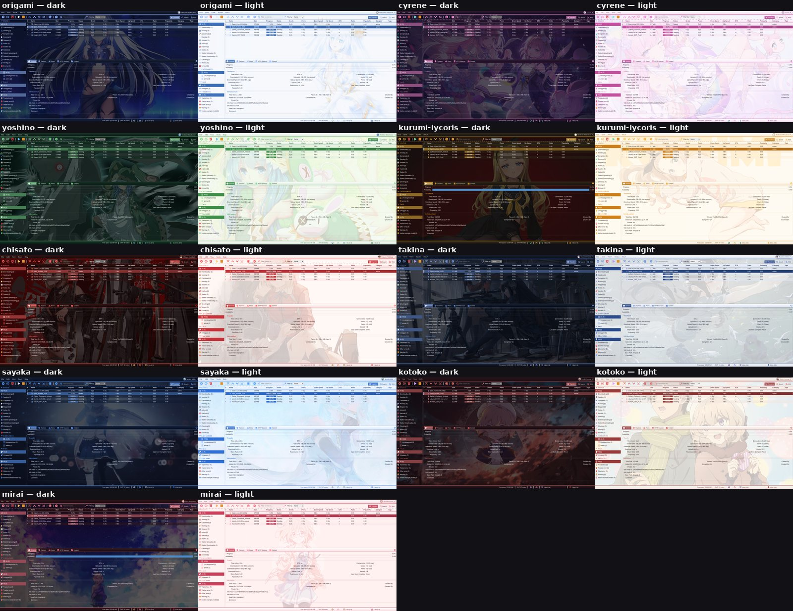
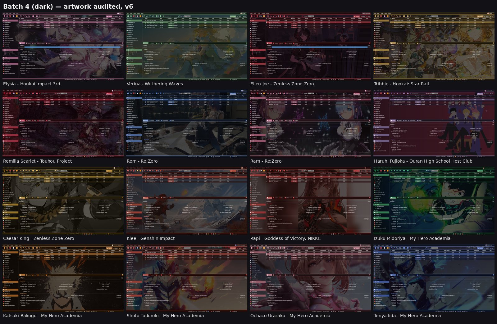
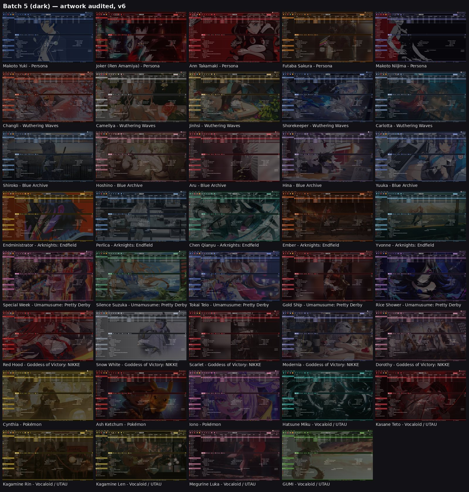

# qBittorrent Anime and Game Themes

Alternative WebUI for qBittorrent **5.2.4** with 72 anime and game characters. Each character has a dark palette and a light palette, recolored icons, a background for each scheme, a login avatar, and an entry in a character picker. The picker searches by name, id, or series and groups characters by series. The choice is stored in `localStorage` for that browser and origin.

Kurumi Tokisaki is the default. The pack is built from qBittorrent's WebUI at tag `release-5.2.4` (`src/webui/www`). The folder you give qBittorrent is [`dist/anime-theme/`](dist/anime-theme/) (it contains `public/` and `private/`). No build step is required to use it.

## Previews

Contact sheets of the character set:







## Install

Copy `dist/anime-theme` (the directory that contains `public/` and `private/`) to the machine that runs qBittorrent, then point the alternative WebUI at that copy.

### Docker (linuxserver/qbittorrent)

1. Copy the folder into the container config, for example `/config/anime-theme`.
2. Open the WebUI and go to **Tools → Options → WebUI**.
3. Enable **Use alternative WebUI**.
4. Set the files location to `/config/anime-theme`.
5. Save and reload the WebUI.

### qBittorrent.conf

Stop the client first, then set:

```
WebUI\AlternativeUIEnabled=true
WebUI\RootFolder=/path/to/anime-theme
```

`RootFolder` is the directory that contains `public/` and `private/`, not the repository root. Start qBittorrent again.

To go back to the stock UI, turn off **Use alternative WebUI**, or set `WebUI\AlternativeUIEnabled=false` while the client is stopped.

## Switching characters and dark/light

The picker has a search box (it matches name, id, or series; Up/Down and Enter choose a row) and groups characters by series in manifest order of first appearance. Avatars in the menu load the first time the menu opens.

- Main UI: use the round avatar and name button on the right of the menu bar. The choice applies immediately, including open dialogs.
- Login page: use the same button in the top-right corner.
- The choice is saved in `localStorage` (`qbtAnimeCharacter`) for this browser and origin. The login page, the main UI, dialogs, and other tabs all use it.
- Dark/light: **Tools → Options → WebUI → Color scheme** (System / Light / Dark). The login page reuses the scheme it last saw in the main UI (`qbtAnimeScheme`). Before that, it follows the OS or browser setting.

## Adding a character

1. Create `src/themes/<id>/` (or, on a server copy, `public/themes/<id>/`):
   - `theme.css`: copy another character's file, replace the id in both selectors, and change the values. Do not put `url()` in this file. Images are found by file name.
   - `bg-dark.webp` and `bg-light.webp` (about 1920 px wide), `avatar.webp` (256×256 face crop), `favicon.png` (32×32).
2. Add an entry to `src/themes/manifest.js` with `id`, `name`, `series`, `icons`, `iconPalette`, and `sources`.
3. Rebuild so `themes/<id>/icons/` is generated:

   ```
   QBT_WEBUI_SRC=/path/to/qBittorrent/src/webui/www python3 src/build.py
   ```

   `QBT_WEBUI_SRC` must be the stock WebUI tree from qBittorrent **release-5.2.4** (`src/webui/www`). The default, if the variable is unset, is `../qBittorrent/src/webui/www` next to this repository. Output is written to `dist/anime-theme/`. Fonts are read from `src/fonts/`.

   If you edit the server copy directly and skip the build, set `"icons": false`. That character then uses the default icons.
4. Raise `"version"` in `manifest.js` so browsers fetch the new `theme.css`.

`src/gen4.py` and `src/gen5.py` are the generators used while the pack was being built. `gen5.py` reads `src/picks.json` and `src/pal.tsv` (override with `ANIME_PICKS` and `ANIME_PAL`).

## Compatibility

- Built against qBittorrent **5.2.4**. A newer qBittorrent release may need a rebuild from that version's WebUI.
- English only. Translation files are not bundled in this Alternative WebUI.
- Icon recoloring uses CSS `content` on `` and CSS variables for background icons. That fully works in Chromium browsers. In browsers that do not support `content` on images, `` icons fall back to the default (Kurumi) colours.

## Layout

```
dist/anime-theme/     ready-to-use Alternative WebUI (public/, private/, README.md)
src/                  build source: build.py, CSS, themes/<id>/, manifest.js
src/fonts/            Cinzel, Playfair Display, Cormorant Garamond (SIL OFL)
docs/previews/        contact-sheet images used above
```

Inside the built theme, `public/themes/manifest.js` is the character list, `theme-loader.js` applies it, and `picker.js` draws the menu. See [`dist/anime-theme/README.md`](dist/anime-theme/README.md) for the file-by-file layout.

## Characters

72 characters in 25 series. Default: Kurumi Tokisaki (`kurumi`).

### Date A Live

- Kurumi Tokisaki (`kurumi`)
- Origami Tobiichi (`origami`)
- Yoshino Himekawa (`yoshino`)

### The Detective Is Already Dead

- Siesta (`siesta`)

### Puella Magi Madoka Magica

- Madoka Kaname (`madoka`)
- Homura Akemi (`homura`)
- Mami Tomoe (`mami`)
- Sayaka Miki (`sayaka`)

### Mushoku Tensei

- Roxy Migurdia (`roxy`)

### Utawarerumono

- Eruruu (`eruruu`)

### Bleach

- Soi Fon (`soifon`)

### Honkai: Star Rail

- Cyrene (`cyrene`)
- Tribbie (`tribbie`)

### Lycoris Recoil

- Kurumi (Lycoris) (`kurumi-lycoris`)
- Chisato Nishikigi (`chisato`)
- Takina Inoue (`takina`)

### In/Spectre

- Kotoko Iwanaga (`kotoko`)

### Beyond the Boundary

- Mirai Kuriyama (`mirai`)

### Honkai Impact 3rd

- Elysia (`elysia`)

### Wuthering Waves

- Verina (`verina`)
- Changli (`changli`)
- Camellya (`camellya`)
- Jinhsi (`jinhsi`)
- Shorekeeper (`shorekeeper`)
- Carlotta (`carlotta`)

### Zenless Zone Zero

- Ellen Joe (`ellen`)
- Caesar King (`caesar`)

### Touhou Project

- Remilia Scarlet (`remilia`)

### Re:Zero

- Rem (`rem`)
- Ram (`ram`)

### Ouran High School Host Club

- Haruhi Fujioka (`haruhi-fujioka`)

### Genshin Impact

- Klee (`klee`)

### Goddess of Victory: NIKKE

- Rapi (`rapi`)
- Red Hood (`red-hood`)
- Snow White (`snow-white`)
- Scarlet (`scarlet`)
- Modernia (`modernia`)
- Dorothy (`dorothy`)

### My Hero Academia

- Izuku Midoriya (`deku`)
- Katsuki Bakugo (`bakugo`)
- Shoto Todoroki (`todoroki`)
- Ochaco Uraraka (`uraraka`)
- Tenya Iida (`iida`)

### Persona

- Makoto Yuki (`makoto-yuki`)
- Joker (Ren Amamiya) (`joker`)
- Ann Takamaki (`ann`)
- Futaba Sakura (`futaba`)
- Makoto Niijima (`makoto-niijima`)

### Blue Archive

- Shiroko (`shiroko`)
- Hoshino (`hoshino`)
- Aru (`aru`)
- Hina (`hina`)
- Yuuka (`yuuka`)

### Arknights: Endfield

- Endministrator (`endministrator`)
- Perlica (`perlica`)
- Chen Qianyu (`chen-qianyu`)
- Ember (`ember`)
- Yvonne (`yvonne`)

### Umamusume: Pretty Derby

- Special Week (`special-week`)
- Silence Suzuka (`silence-suzuka`)
- Tokai Teio (`tokai-teio`)
- Gold Ship (`gold-ship`)
- Rice Shower (`rice-shower`)

### Pokémon

- Cynthia (`cynthia`)
- Ash Ketchum (`ash`)
- Iono (`iono`)

### Vocaloid / UTAU

- Hatsune Miku (`miku`)
- Kasane Teto (`teto`)
- Kagamine Rin (`rin`)
- Kagamine Len (`len`)
- Megurine Luka (`luka`)
- GUMI (`gumi`)

## Image credits

Credit in brackets is the artist or official account named in the wallhaven source link (pixiv works are checked against pixiv's own AI flag; all listed pixiv works are declared non-AI or predate AI image tools).

| Character | Dark background | Light background | Avatar crop |
|---|---|---|---|
| Kurumi Tokisaki | https://wallhaven.cc/w/48882k (no source link; uploaded 2015-03-07, before AI image tools) | https://wallhaven.cc/w/p2k62m (no source link; uploaded 2016-05-31, before AI image tools) | https://wallhaven.cc/w/3zmmdy (pixiv: Feint) |
| Siesta | https://wallhaven.cc/w/j3j5vm (no source link; uploaded 2022-03-27, before AI image tools) | https://wallhaven.cc/w/o3ry79 (no source link; uploaded 2022-06-12, before AI image tools) | https://wallhaven.cc/w/6ormrw (no source link; uploaded 2022-06-12, before AI image tools) |
| Madoka Kaname | https://wallhaven.cc/w/j3qo15 (no source link; uploaded 2022-02-18, before AI image tools) | https://wallhaven.cc/w/4y95d7 (pixiv: 稀泥m) | https://wallhaven.cc/w/5gpg11 (pixiv: 失序纠昼) |
| Homura Akemi | https://wallhaven.cc/w/l3pvj2 (discord.gg) | https://wallhaven.cc/w/4723g9 (no source link; uploaded 2014-09-29, before AI image tools) | https://wallhaven.cc/w/95m1yk (no source link; uploaded 2016-05-30, before AI image tools) |
| Roxy Migurdia | https://wallhaven.cc/w/j3zqlq (wallhaven.cc) | https://wallhaven.cc/w/1pvlg9 (pixiv: loong) | https://wallhaven.cc/w/72kyke (no source link; uploaded 2022-04-19, before AI image tools) |
| Eruruu | https://wallhaven.cc/w/mpl9gm (no source link; uploaded 2016-06-29, before AI image tools) | https://wallhaven.cc/w/j8kke5 (no source link; uploaded 2016-10-20, before AI image tools) | https://wallhaven.cc/w/mpl9gm (no source link; uploaded 2016-06-29, before AI image tools) |
| Mami Tomoe | https://wallhaven.cc/w/z8jpro (no source link; uploaded 2022-03-31, before AI image tools) | https://wallhaven.cc/w/76g3kv (no source link; uploaded 2016-02-12, before AI image tools) | https://wallhaven.cc/w/z8jpro (no source link; uploaded 2022-03-31, before AI image tools) |
| Soi Fon | https://wallhaven.cc/w/nzvy9y (DeviantArt: davidgalopim) | https://wallhaven.cc/w/9mm6q8 (no source link; uploaded 2021-02-06, before AI image tools) | https://wallhaven.cc/w/9mm6q8 (no source link; uploaded 2021-02-06, before AI image tools) |
| Origami Tobiichi | https://wallhaven.cc/w/dpj3do (no source link; uploaded 2022-05-18, before AI image tools) | https://wallhaven.cc/w/vg2828 (DeviantArt: kanenash) | https://wallhaven.cc/w/9mpqlx (no source link; uploaded 2022-05-08, before AI image tools) |
| Cyrene | https://wallhaven.cc/w/8gkkm2 (pixiv: HAYUN) | https://wallhaven.cc/w/2116k9 (pixiv: 爱画画的噗叽) | https://wallhaven.cc/w/6llo5w (pixiv: AL光) |
| Yoshino Himekawa | https://wallhaven.cc/w/4gq7y3 (no source link; uploaded 2014-11-13, before AI image tools) | https://wallhaven.cc/w/763j19 (no source link; uploaded 2016-04-10, before AI image tools) | https://wallhaven.cc/w/43xze3 (no source link; uploaded 2016-01-15, before AI image tools) |
| Kurumi (Lycoris) | https://wallhaven.cc/w/8578pk (no source link; uploaded 2022-09-29, before AI image tools) | https://wallhaven.cc/w/zygv2o (no source link; uploaded 2022-09-29, before AI image tools) | https://wallhaven.cc/w/l35rm2 (no source link; uploaded 2022-08-19, before AI image tools) |
| Chisato Nishikigi | https://wallhaven.cc/w/rq7o2q (pixiv: NEKO♨ BFG5) | https://wallhaven.cc/w/k7yxd6 (pixiv: 陌芋Marginal) | https://wallhaven.cc/w/rdmdrj (pixiv: 陌芋Marginal) |
| Takina Inoue | https://wallhaven.cc/w/gpjm3d (@yanshoujie) | https://wallhaven.cc/w/8o2p5y (@Cheon1986) | https://wallhaven.cc/w/xe53lo (pixiv: RoyBoy) |
| Sayaka Miki | https://wallhaven.cc/w/0prwj9 (no source link; uploaded 2016-01-19, before AI image tools) | https://wallhaven.cc/w/p96p69 (pixiv: Oxy) | https://wallhaven.cc/w/01q1w3 (no source link; uploaded 2014-10-21, before AI image tools) |
| Kotoko Iwanaga | https://wallhaven.cc/w/73vemy (no source link; uploaded 2020-05-07, before AI image tools) | https://wallhaven.cc/w/dpkxeg (no source link; uploaded 2021-06-18, before AI image tools) | https://wallhaven.cc/w/dpkxeg (no source link; uploaded 2021-06-18, before AI image tools) |
| Mirai Kuriyama | https://wallhaven.cc/w/2k1j6m (no source link; uploaded 2016-07-10, before AI image tools) | https://wallhaven.cc/w/p2q8pp (DeviantArt: noerulb) | https://wallhaven.cc/w/r2o9lm (no source link; uploaded 2019-06-21, before AI image tools) |
| Elysia | https://wallhaven.cc/w/gpz95e (official @HonkaiImpact3rd) | https://wallhaven.cc/w/l3l5lp (no source link; uploaded 2022-08-06, before AI image tools) | https://wallhaven.cc/w/l3l5lp (no source link; uploaded 2022-08-06, before AI image tools) |
| Verina | https://wallhaven.cc/w/6d1zvx (@Yunouou10) | https://wallhaven.cc/w/85w1py (@Yunouou10) | https://wallhaven.cc/w/85w1py (@Yunouou10) |
| Ellen Joe | https://wallhaven.cc/w/l8p6dy (pixiv: DAwDA) | https://wallhaven.cc/w/x6ojqd (pixiv: Salmon88) | https://wallhaven.cc/w/m35wj1 (pixiv: 天祈Eric) |
| Tribbie | https://wallhaven.cc/w/rrvgxm (pixiv: DL) | https://wallhaven.cc/w/211dyx (pixiv: 千牵签) | https://wallhaven.cc/w/rrvgxm (pixiv: DL) |
| Remilia Scarlet | https://wallhaven.cc/w/eoyygo (no source link; uploaded 2016-04-07, before AI image tools) | https://wallhaven.cc/w/6og2l7 (pixiv: ヒトこもる) | https://wallhaven.cc/w/72gk59 (pixiv: ヒトこもる) |
| Rem | https://wallhaven.cc/w/6k3oyq (ArtStation) | https://wallhaven.cc/w/mp19lm (no source link; uploaded 2016-09-05, before AI image tools) | https://wallhaven.cc/w/1j1om9 (no source link; uploaded 2016-08-11, before AI image tools) |
| Ram | https://wallhaven.cc/w/od5el9 (no source link; uploaded 2016-06-18, before AI image tools) | https://wallhaven.cc/w/eokelr (DeviantArt: yuki-neh) | https://wallhaven.cc/w/eokelr (DeviantArt: yuki-neh) |
| Haruhi Fujioka | https://wallhaven.cc/w/z89r5v (no source link; uploaded 2021-11-10, before AI image tools) | https://wallhaven.cc/w/q2o8l5 (no source link; uploaded 2021-11-10, before AI image tools) | https://wallhaven.cc/w/q2o8l5 (no source link; uploaded 2021-11-10, before AI image tools) |
| Caesar King | https://wallhaven.cc/w/5y7zw8 (official art) | https://wallhaven.cc/w/5yrzy1 (official art, miyoushe.com) | https://wallhaven.cc/w/1qd9o1 (official art) |
| Klee | https://wallhaven.cc/w/1k1gkg (pixiv: 日宝) | https://wallhaven.cc/w/zm1qdo (no source link; uploaded 2020-10-01, before AI image tools) | https://wallhaven.cc/w/zm1qdo (no source link; uploaded 2020-10-01, before AI image tools) |
| Rapi | https://wallhaven.cc/w/gppyy7 (pixiv: RIZE リゼ) | https://wallhaven.cc/w/y89ldk (official art, nikke-kr.com) | https://wallhaven.cc/w/gppyy7 (pixiv: RIZE リゼ) |
| Izuku Midoriya | https://wallhaven.cc/w/j8rz9p (no source link; uploaded 2017-06-03, before AI image tools) | https://wallhaven.cc/w/r75po7 (no source link; uploaded 2017-06-28, before AI image tools) | https://wallhaven.cc/w/r75po7 (no source link; uploaded 2017-06-28, before AI image tools) |
| Katsuki Bakugo | https://wallhaven.cc/w/2kv2gg (DeviantArt: krukmeister) | https://wallhaven.cc/w/r7emdj (no source link; uploaded 2017-04-26, before AI image tools) | https://wallhaven.cc/w/2kv2gg (DeviantArt: krukmeister) |
| Shoto Todoroki | https://wallhaven.cc/w/eyv8m8 (DeviantArt: jeffchendesigns) | https://wallhaven.cc/w/2k5xdg (no source link; uploaded 2017-08-16, before AI image tools) | https://wallhaven.cc/w/2k5xdg (no source link; uploaded 2017-08-16, before AI image tools) |
| Ochaco Uraraka | https://wallhaven.cc/w/8358rk (no source link; uploaded 2018-12-20, before AI image tools) | https://wallhaven.cc/w/2k6mmy (no source link; uploaded 2017-04-26, before AI image tools) | https://wallhaven.cc/w/8358rk (no source link; uploaded 2018-12-20, before AI image tools) |
| Tenya Iida | https://wallhaven.cc/w/g81w63 (DeviantArt: jeffchendesigns) | https://wallhaven.cc/w/57jo23 (no source link; uploaded 2022-02-20, before AI image tools) | https://wallhaven.cc/w/vgvp9p (pixiv: Mika Pikazo) |
| Makoto Yuki | https://wallhaven.cc/w/837x3k (no source link; uploaded 2018-06-11, before AI image tools) | https://wallhaven.cc/w/k8zd97 (@Jurawings1) | https://wallhaven.cc/w/837x3k (no source link; uploaded 2018-06-11, before AI image tools) |
| Joker (Ren Amamiya) | https://wallhaven.cc/w/767m9o (DeviantArt: lucien92) | https://wallhaven.cc/w/3kxl13 (no source link; uploaded 2018-05-09, before AI image tools) | https://wallhaven.cc/w/767m9o (DeviantArt: lucien92) |
| Ann Takamaki | https://wallhaven.cc/w/zx2k6w (no source link; uploaded 2017-06-07, before AI image tools) | https://wallhaven.cc/w/kwor61 (no source link; uploaded 2020-07-16, before AI image tools) | https://wallhaven.cc/w/kwor61 (no source link; uploaded 2020-07-16, before AI image tools) |
| Futaba Sakura | https://wallhaven.cc/w/8ovrjo (no source link; uploaded 2022-05-21, before AI image tools) | https://wallhaven.cc/w/g781jl (no source link; uploaded 2021-01-18, before AI image tools) | https://wallhaven.cc/w/g781jl (no source link; uploaded 2021-01-18, before AI image tools) |
| Makoto Niijima | https://wallhaven.cc/w/k9r1k7 (no source link; uploaded 2017-05-16, before AI image tools) | https://wallhaven.cc/w/ymdqr7 (no source link; uploaded 2020-07-06, before AI image tools) | https://wallhaven.cc/w/ymdqr7 (no source link; uploaded 2020-07-06, before AI image tools) |
| Changli | https://wallhaven.cc/w/6lylg6 (@awer486) | https://wallhaven.cc/w/qzkwjl (pixiv: 雨様sama) | https://wallhaven.cc/w/6lylg6 (@awer486) |
| Camellya | https://wallhaven.cc/w/kxoqx6 (pixiv: 亚细亚yxy) | https://wallhaven.cc/w/5gxxd9 (@vvsimyeol) | https://wallhaven.cc/w/kxoqx6 (pixiv: 亚细亚yxy) |
| Jinhsi | https://wallhaven.cc/w/jxpjyw (pixiv: ShotGunMan) | https://wallhaven.cc/w/kxp5r7 (@6KUAIMO) | https://wallhaven.cc/w/jxpjyw (pixiv: ShotGunMan) |
| Shorekeeper | https://wallhaven.cc/w/qzy187 (pixiv: Rafa) | https://wallhaven.cc/w/jx25qw (pixiv: void_0) | https://wallhaven.cc/w/jx25qw (pixiv: void_0) |
| Carlotta | https://wallhaven.cc/w/o5zgw5 (official @Wuthering_Waves) | https://wallhaven.cc/w/x6vkeo (official @Wuthering_Waves) | https://wallhaven.cc/w/x6vkeo (official @Wuthering_Waves) |
| Shiroko | https://wallhaven.cc/w/j3qjjy (no source link; uploaded 2022-02-19, before AI image tools) | https://wallhaven.cc/w/d65xol (pixiv: Sagiri) | https://wallhaven.cc/w/d65xol (pixiv: Sagiri) |
| Hoshino | https://wallhaven.cc/w/zpz1lv (pixiv: どうむ) | https://wallhaven.cc/w/vqm8qm (pixiv: アラシオモト) | https://wallhaven.cc/w/vqm8qm (pixiv: アラシオモト) |
| Aru | https://wallhaven.cc/w/l3xw82 (no source link; uploaded 2022-05-18, before AI image tools) | https://wallhaven.cc/w/3l7gqd (pixiv: 镜丶GORK) | https://wallhaven.cc/w/gw18le (@_okkizzz) |
| Hina | https://wallhaven.cc/w/9dep2k (pixiv: Spiceメガ) | https://wallhaven.cc/w/x63pml (pixiv: 冰暖暖) | https://wallhaven.cc/w/kx6d36 (pixiv: NEBU) |
| Yuuka | https://wallhaven.cc/w/2y3mo6 (pixiv: 弐ノ星　リョウ) | https://wallhaven.cc/w/2y3mo6 (pixiv: 弐ノ星　リョウ) | https://wallhaven.cc/w/2y3mo6 (pixiv: 弐ノ星　リョウ) |
| Endministrator | https://wallhaven.cc/w/w56zxx (@Re24jp) | https://wallhaven.cc/w/qrjwpd (@wisdafuzuo) | https://wallhaven.cc/w/w56zxx (@Re24jp) |
| Perlica | https://wallhaven.cc/w/5y3qv7 (@fang20041004) | https://wallhaven.cc/w/7j9dev (@ryuzakiichi) | https://wallhaven.cc/w/7j9dev (@ryuzakiichi) |
| Chen Qianyu | https://wallhaven.cc/w/5yz133 (@ameriya7) | https://wallhaven.cc/w/rqgv6q (@hoshieve) | https://wallhaven.cc/w/mlg379 (pixiv: 病队BD) |
| Ember | https://wallhaven.cc/w/ogyk2m (weibo.com) | https://wallhaven.cc/w/7j9drv (weibo.com) | https://wallhaven.cc/w/k8zmd7 (@_Chuzenji_) |
| Yvonne | https://wallhaven.cc/w/d839v3 (@gyoukan000) | https://wallhaven.cc/w/og61mm (pixiv: fztt) | https://wallhaven.cc/w/og61mm (pixiv: fztt) |
| Special Week | https://wallhaven.cc/w/pkzoj3 (no source link; uploaded 2022-04-25, before AI image tools) | https://wallhaven.cc/w/vm7v7m (no source link; uploaded 2018-05-25, before AI image tools) | https://wallhaven.cc/w/vm7v7m (no source link; uploaded 2018-05-25, before AI image tools) |
| Silence Suzuka | https://wallhaven.cc/w/l3wgkq (pixiv: Kuhno伍侍_) | https://wallhaven.cc/w/mdqz39 (pixiv: ピロ水) | https://wallhaven.cc/w/l3wgkq (pixiv: Kuhno伍侍_) |
| Tokai Teio | https://wallhaven.cc/w/m91e38 (pixiv: 。ぱにぽ) | https://wallhaven.cc/w/721lp3 (pixiv: はしもと) | https://wallhaven.cc/w/m91e38 (pixiv: 。ぱにぽ) |
| Gold Ship | https://wallhaven.cc/w/3zv9z6 (no source link; uploaded 2022-05-13, before AI image tools) | https://wallhaven.cc/w/l3d3my (no source link; uploaded 2021-10-25, before AI image tools) | https://wallhaven.cc/w/3zv9z6 (no source link; uploaded 2022-05-13, before AI image tools) |
| Rice Shower | https://wallhaven.cc/w/j326mp (no source link; uploaded 2022-08-07, before AI image tools) | https://wallhaven.cc/w/9dxv2x (pixiv: 笹目めと＠仕事募集) | https://wallhaven.cc/w/72v32y (no source link; uploaded 2022-05-13, before AI image tools) |
| Red Hood | https://wallhaven.cc/w/w565g6 (pixiv: なつむ。＠Skeb大募集) | https://wallhaven.cc/w/9ogv5d (official @NIKKE_en) | https://wallhaven.cc/w/w565g6 (pixiv: なつむ。＠Skeb大募集) |
| Snow White | https://wallhaven.cc/w/3z28p3 (official art, nikke-kr.com) | https://wallhaven.cc/w/3z28p3 (official art, nikke-kr.com) | https://wallhaven.cc/w/3z28p3 (official art, nikke-kr.com) |
| Scarlet | https://wallhaven.cc/w/l8ooql (pixiv: 米粒Duona) | https://wallhaven.cc/w/gw9gwe (pixiv: shiej007) | https://wallhaven.cc/w/rr1xjm (pixiv: moda) |
| Modernia | https://wallhaven.cc/w/x68r2l (@hikinito0902) | https://wallhaven.cc/w/x68r2l (@hikinito0902) | https://wallhaven.cc/w/x68r2l (@hikinito0902) |
| Dorothy | https://wallhaven.cc/w/lymxol (nikke-concert.jp) | https://wallhaven.cc/w/6d6116 (pixiv: Megu) | https://wallhaven.cc/w/6d6116 (pixiv: Megu) |
| Cynthia | https://wallhaven.cc/w/gw8l7d (@Fagi_Kakikaki) | https://wallhaven.cc/w/g7xq37 (no source link; uploaded 2022-02-10, before AI image tools) | https://wallhaven.cc/w/ly98py (pixiv: ふぁぎ) |
| Ash Ketchum | https://wallhaven.cc/w/8od7ey (DeviantArt: roeeater) | https://wallhaven.cc/w/l8z7rq (@Lv01KOKUEN) | https://wallhaven.cc/w/8od7ey (DeviantArt: roeeater) |
| Iono | https://wallhaven.cc/w/7j215o (@onamuzi_illust) | https://wallhaven.cc/w/og6yd5 (pixiv: サヤ) | https://wallhaven.cc/w/7j215o (@onamuzi_illust) |
| Hatsune Miku | https://wallhaven.cc/w/1ppld1 (pixiv: 千夜QYS3) | https://wallhaven.cc/w/1kg8eg (pixiv: はむねずこ) | https://wallhaven.cc/w/0q3q8q (pixiv: ゴリ男氏) |
| Kasane Teto | https://wallhaven.cc/w/3q6kmd (pixiv: DIO) | https://wallhaven.cc/w/xlpm9z (no source link; uploaded 2019-07-29, before AI image tools) | https://wallhaven.cc/w/xlpm9z (no source link; uploaded 2019-07-29, before AI image tools) |
| Kagamine Rin | https://wallhaven.cc/w/ym31yk (pixiv: saihate) | https://wallhaven.cc/w/83xgrj (no source link; uploaded 2018-07-30, before AI image tools) | https://wallhaven.cc/w/83xgrj (no source link; uploaded 2018-07-30, before AI image tools) |
| Kagamine Len | https://wallhaven.cc/w/3z9x9d (no source link; uploaded 2021-02-01, before AI image tools) | https://wallhaven.cc/w/ymzvw7 (no source link; uploaded 2020-10-03, before AI image tools) | https://wallhaven.cc/w/3z9x9d (no source link; uploaded 2021-02-01, before AI image tools) |
| Megurine Luka | https://wallhaven.cc/w/eyp9xl (pixiv: Recneps-SAIS) | https://wallhaven.cc/w/0jr68p (no source link; uploaded 2015-04-16, before AI image tools) | https://wallhaven.cc/w/0jr68p (no source link; uploaded 2015-04-16, before AI image tools) |
| GUMI | https://wallhaven.cc/w/45jm55 (no source link; uploaded 2015-05-03, before AI image tools) | https://wallhaven.cc/w/lqyrrq (no source link; uploaded 2016-07-10, before AI image tools) | https://wallhaven.cc/w/lqyrrq (no source link; uploaded 2016-07-10, before AI image tools) |

### AI-art audit (manifest version 6)

The images were audited to exclude AI-generated art. Every wallhaven id was checked for AI tags, AI-site sources (PixAI, Civitai, NovelAI, and similar), pixiv's `aiType` flag, upload date, and a visual pass. Images with no verifiable human artist uploaded after Oct 2022, a confirmed-AI look, or that were weak picks were replaced with credited, human-made art. 35 slots were replaced; the table above is the current credit list. The replacement log is [`src/AI-AUDIT.md`](src/AI-AUDIT.md).

Artwork belongs to its respective artists and rights holders. It is included here for personal, non-commercial use, and it is not covered by the GPL license on the code. If you are a rights holder and want an image removed, open an issue and it will be taken down.

The Cinzel, Playfair Display, and Cormorant Garamond font files are under the SIL Open Font License, separate from both the GPL code and the character artwork.

## License

The code in this repository, including the qBittorrent WebUI files it is derived from, is licensed under **GPL-2.0-or-later**. See [LICENSE](LICENSE). Third-party artwork is not covered by that license.
